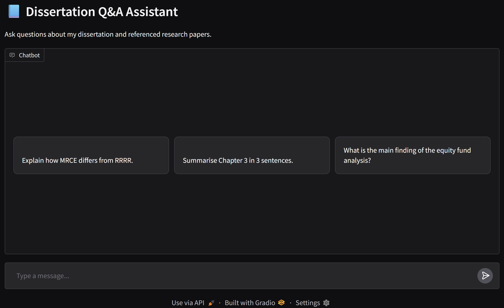
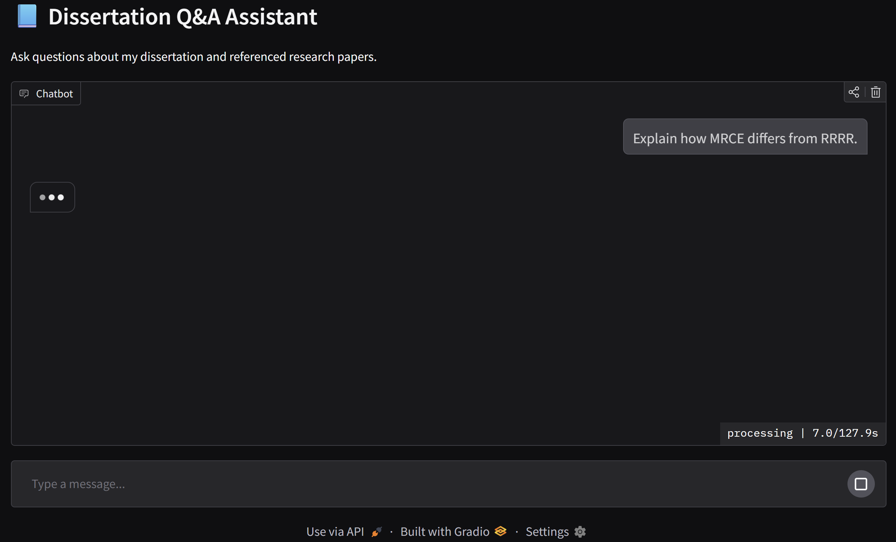
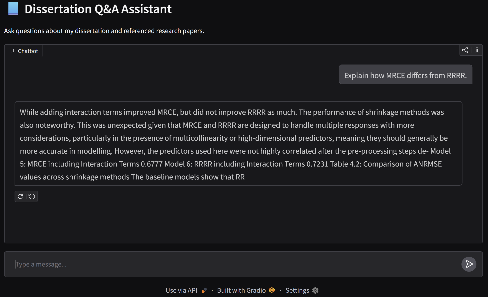

# Dissertation Chatbot

*A chatbot that interprets user queries about equity fund profitability and sustainability using Multiple-Response Regression models.*

---

## **Why I Built It**
- **Problem:** Financial analysis tools often lack user-friendly interfaces for querying complex statistical models.  
- **Motivation:** I wanted to bridge this gap by creating a chatbot that translates people's queries into insights using models from my dissertation.  
- **Goal:** Make complex statistical modelling (Multiple-Response Linear Regression (MRLR), Random Forests, XGBoost) accessible via a conversational interface.

---

## **Architecture Overview**
  

**Key Components:**
- **Chat Interface:** Streamlit (frontend UI)  
- **Backend:** FastAPI (Python) integrated with R models via Plumber or reticulate  
- **Models:** MRLR, Random Forest, XGBoost (trained on equity fund data)  
- **Hosting:** Deployed using Hugging Face Spaces and Gradio 

**Trade-offs:**
- Prioritised **interpretability over raw accuracy** by including MRLR for transparent predictions.
- Chose **FastAPI** for speed and async capabilities instead of Flask.
- Integrated **R models** rather than rewriting all models in Python to preserve the statistical accuracy of dissertation code.

---

## **What I Learned**
- **System Design:** Bridging R and Python environments for model serving requires efficient serialisation and caching to reduce latency.
- **Model Insights:** MRLR provided explainability for feature effects, while XGBoost offered improved predictive accuracy.
- **Soft Skills:** Improved ability to communicate complex modelling ideas to non-technical users through UI design.

---

## **Tech Stack**
| Component  | Technology |
|------------|------------|
| **Frontend**   | Streamlit |
| **Backend**    | Python |
| **Models**     | R (MRLR, Random Forests), Python (XGBoost) |
| **Deployment** | Hugging Face Spaces and Gradio |

---

## **Demo**
- **[Live Demo]([https://huggingface.co/spaces/runnithan03/dissertation-chatbot])** – *Try the chatbot here!*  

---

## **Chatbot in Action** 
  
  

---

## **How to Run Locally**
Clone the repo and install dependencies:
```bash
git clone https://github.com/runnithan03/dissertation-chatbot.git
cd dissertation-chatbot
pip install -r requirements.txt
```

Finally, run the app:
```bash
streamlit run app.py
```

## **Repository Structure and Breakdown** 
├── images/ # Screenshots and architecture diagrams for the README  
├── README.md # Project documentation  
├── app.py # Main chatbot app (Gradio/Streamlit entry point)  
├── chunks.pkl # Pickled data chunks used for embeddings or retrieval    
├── data_ingestion.py # Script for ingesting and preprocessing data:

### What This Does

1. **Installs necessary libraries:**
   - `pypdf` for extracting text from PDFs.
   - `langchain` for text chunking.
   - `sentence-transformers` and `faiss-cpu` (which are used in the next step).

2. **Uploads dissertation PDFs**.

3. **Extracts text from all PDFs into one string.**

4. **Splits the text into chunks (500 characters)** with **100 characters overlap** for better retrieval context.

├── embeddings.npy # Precomputed embeddings for vector search    
├── embeddings_store.py # Manages the creation and storage of embeddings:

### What This Does

In this step, we:
1. **Convert all text chunks into embeddings** using `sentence-transformers`.  
   - An embedding is a vector (e.g., 384 dimensions) representing the meaning of a text.  
   - Semantically similar texts have embeddings that are close together in vector space.

2. **Store embeddings in FAISS**, a high-performance vector database.  
   - FAISS allows us to quickly retrieve the most relevant chunks given a query.

3. **Run a test query** to confirm the pipeline works:
   - The query is embedded.
   - FAISS returns the top 3 most similar chunks from the dissertation dataset.

├── faiss_index.bin # FAISS index for efficient similarity search    
├── query_pipeline.py # Pipeline logic to handle queries and retrieve answers:  

### What this does

In this step, we:
1. **Take a user query** and embed it using the same SentenceTransformer model.
2. **Retrieve the top-k most relevant chunks** from the FAISS index.
3. **Combine the chunks with the question** and pass them to a pre-trained LLM (e.g., GPT-4 via OpenAI API).
4. **Generate a final answer** that is both context-aware and grounded in your dissertation data.

---

**Why This Works:**
- The FAISS retriever ensures the LLM receives only the most relevant context.
- The LLM then uses its language understanding + the provided context to produce accurate answers.

---

├── requirements.txt # Python dependencies
